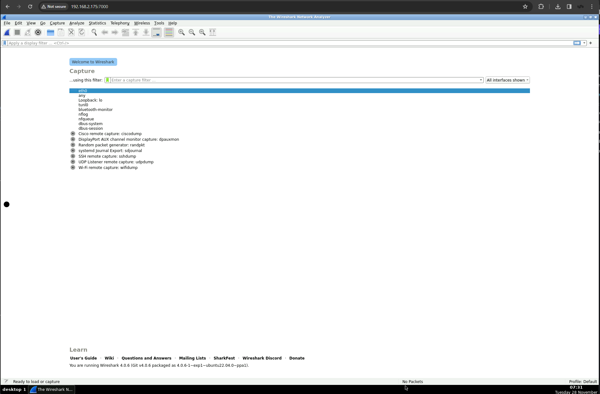

# Disk Encryption

On select models of FMADIO capture systems full disk encryption is available. When available it uses the SSD drivers controller firmware to provide AES256 encryption with the OPAL interface standard.\
\
States of the system is as follows\
\
**Power Off:**\
All data is encrypted accessing requires a password\
\
**First Power On:**\
Drives are accessible but data remains encrypted\
\
**First Power On Unlock:**\
Each drive in the system is unlocked by a shared password. This allows the drives media to be written/read from\
\
**Warm Reboot:**\
After Unlock the drives remain unlocked\
\
**Power Off:**\
On power loss to the disks, all data becomes un-accessible and fully encrypted\
\
\
Data is encrypted using AESS256 and a random key generated by the SSD Controller. The Password specified encrypts/decrypts this AES256 key allowing the controller to read/write from the media. This encryption key is only kept in volatile RAM, thus when power to the drive is removed, the encryption key is lost. Once the encryption key is gone all data on the storage media can not be read.\
\
Drives can never be "bricked" as the drives can be reset by creating a new AES256 key. This reset however will remove all data previously written to the drive.

### Disk state flow chart

<figure><figcaption><p>Encrypted Disk flow chart</p></figcaption></figure>

### **Drive Encryption Status**

```
fmadiocli "show disk status"
```

This Operation displays the drive encryption state, documentation found here

[https://docs.fmad.io/fmadio-documentation/cli-reference/fmadiocli#show-disk-status](https://docs.fmad.io/fmadio-documentation/cli-reference/fmadiocli#show-disk-status)\


### **Sanitize / Format**

```
fmadiocli "config disk sanitize"
```

This sets a new encryption password on all the disks. It will also WIPE ALL DATA ON THE CURRENT DISK. Please ensure there is no critical data on the system before running this command. After the operation the disks are in an UNLOCKED state.

[https://docs.fmad.io/fmadio-documentation/cli-reference/fmadiocli#config-disk-sanitize](https://docs.fmad.io/fmadio-documentation/cli-reference/fmadiocli#config-disk-sanitize)\
\
Setting Password

### Disk Password

Drives always have a password set, either a default password or a custom password the following command sets the disk password used for unlocking



### **Locking Disk**

By default disks are not a locked state. e.g. they do not require a password to be usable. This setting puts the disks into a locked state which when ever it loses power requires a password to unlock and make usable



### Disable Locking

There are cases where disabling the Locking function without destoying the data is helpful, note this is different from unlocking the disks.&#x20;

This function disables requring a password to access the disks persistently.

Unlockingly the disks allows disk access but is not persistant

The functions are similar but quite different, documentation on how to perform this is&#x20;

[https://docs.fmad.io/fmadio-documentation/cli-reference/fmadiocli#config-disk-no-lock](https://docs.fmad.io/fmadio-documentation/cli-reference/fmadiocli#config-disk-no-lock)

### **Unlocking**

```
fmadiocli "config disk unlock"
```

Command will unlock and verify correct functionality of the disks. Starts by unlocking each disk using the supplied password, then reloading all storage components of the FMADIO system which reference the disks.&#x20;

Reference documentation is&#x20;

[https://docs.fmad.io/fmadio-documentation/cli-reference/fmadiocli#config-disk-unlock](https://docs.fmad.io/fmadio-documentation/cli-reference/fmadiocli#config-disk-unlock)\
