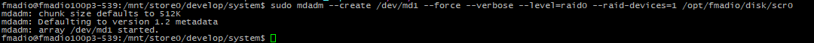

# BMC Upgrade

Upgrading the BMC software is simple process but requires physical access to the system. Physical access is required as the power cables need to be disconnected after BMC upgrade has been completed.

### Step 1)

Retrieve the current BMC version as follows

```
sudo ipmitool bmc info
```

Example output

```
fmadio@fmadio100v2-228U:/opt/fmadio/firmware/bmc$ sudo ipmitool bmc info
Device ID                 : 32
Device Revision           : 1
Firmware Revision         : 12.41
IPMI Version              : 2.0
Manufacturer ID           : 15370
Manufacturer Name         : Unknown (0x3C0A)
Product ID                : 308 (0x0134)
Product Name              : Unknown (0x134)
Device Available          : yes
Provides Device SDRs      : yes
Additional Device Support :
    Sensor Device
    SDR Repository Device
    SEL Device
    FRU Inventory Device
    IPMB Event Receiver
    IPMB Event Generator
    Chassis Device
Aux Firmware Rev Info     :
    0x0b
    0x00
    0x00
    0x00
fmadio@fmadio100v2-228U:/opt/fmadio/firmware/bmc$

```

The key value difference is shown below, the firmware gets upgraded to version 0xd shown below. If the system already shows version 0xd there is no need to upgrade the BMC software

<figure><figcaption></figcaption></figure>

### Step 2)

Run the BMC update  in the following directory

```
cd /opt/fmadio/firmware/bmc/
```

Then run the update program

```
sudo ./flash64.sh
```

Enter Y for preserve configuration settings.

The process will take several minutes to complete

```
fmadio@fmadio100v2-228U:/opt/fmadio/firmware/bmc$ sudo ./flash64.sh
chmod: gigaflash_x64: Read-only file system
chmod: socflash_x64: Read-only file system
gigaflash v1.6.3
Do you want to preserve configuration? (Y/n)
Y
Loading Firmware...
Update Firmware
Wait 90 seconds for BMC Ready...
fmadio@fmadio100v2-228U:/opt/fmadio/firmware/bmc$

```

### Step 3)

Disconnect the AC power from the system. Wait for 1 minute

### Step 4)

Reconnect AC power to the system

### Step 5)

Wait 5minutes for the BMC to fully reboot and host system boot

### Step 6)

Reboot the linux Host server

```
sudo reboot
```

### Step 7)

After host linux system has rebooted, Check BMC version is updated. It should show version 0xD per image below

```
sudo ipmitool bmc info
```

<figure><figcaption></figcaption></figure>

### &#x20;Step 8)

Update is complete
